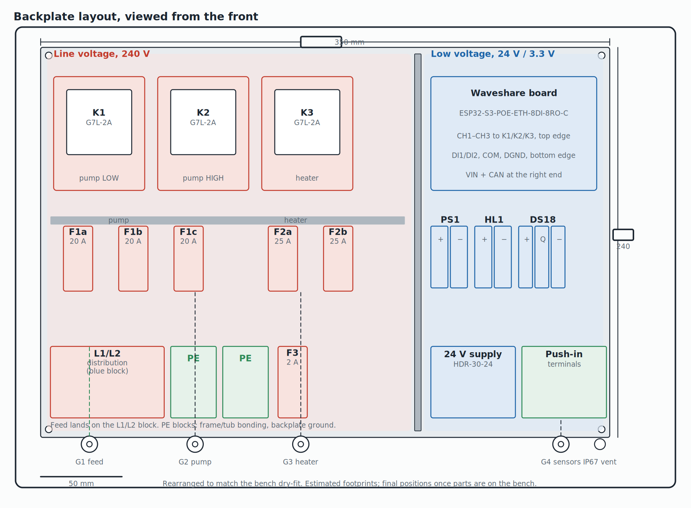
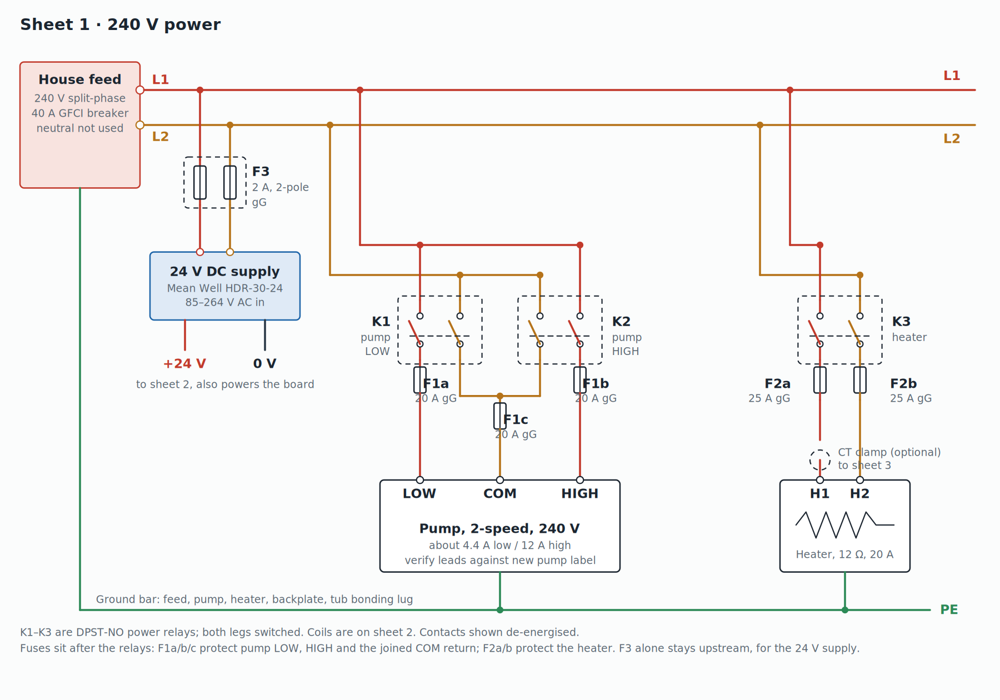
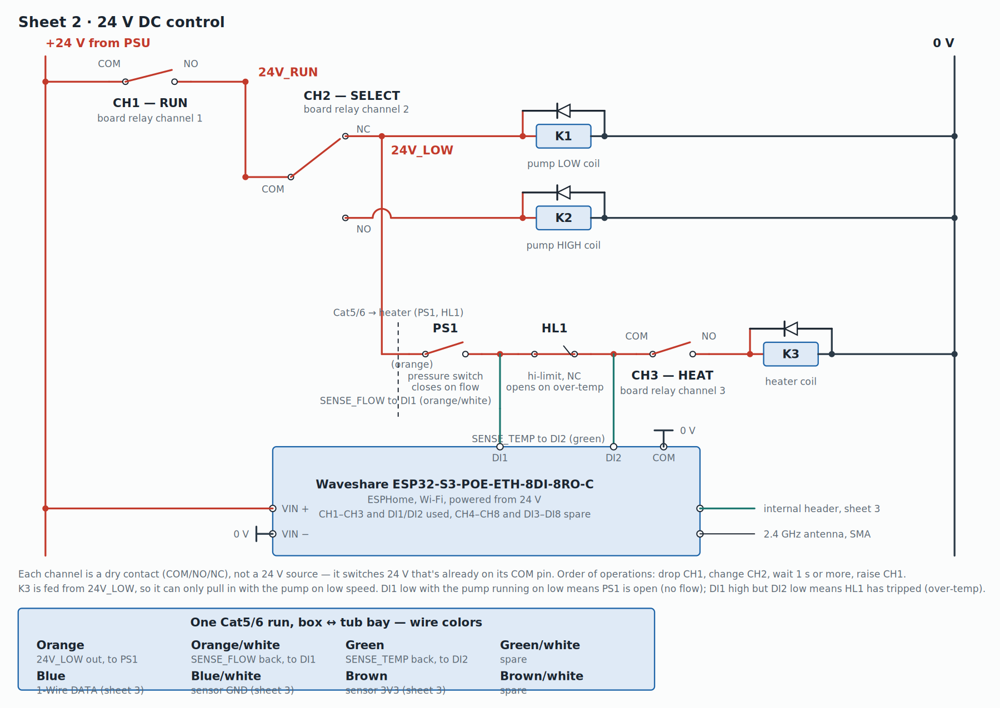
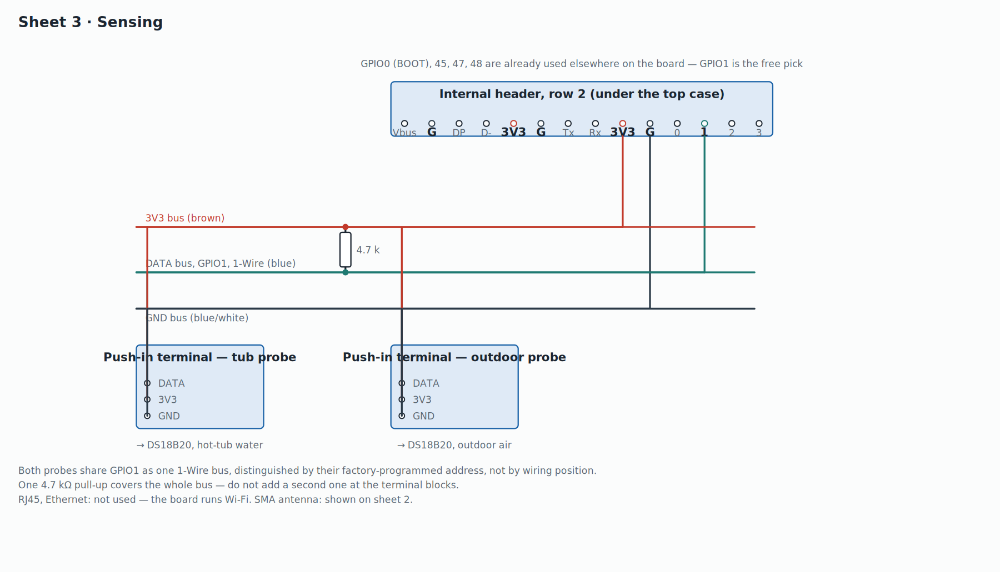

# Hot Tub Controller — Hardware Design

In-spa/in-box controller for a hot tub.
Waveshare ESP32-S3-POE-ETH-8DI-8RO-C driving three 25 A relays for the
pump (two-speed) and heater, in an IP67 enclosure mounted outside the
tub, on the house wall.

This is a static export of the working drawings. Diagrams are PNGs in
this same folder — open this file and the images together, or view
them individually.

---

## Backplate layout

Relays and the Waveshare board share the top row (matching the bench
dry-fit), fuses sit below them, and the L1/L2 distribution, ground
blocks, F3 and the 24 V supply run along the bottom. Footprints are
estimated — confirm real dimensions once parts are on the bench before
drilling.

---

## Sheet 1 — 240 V power

K1–K3 are DPST-NO power relays; both legs switched. Coils are driven
from sheet 2. Fuses sit **after** the relays: F1a/b/c protect the
pump's LOW, HIGH and joined COM return; F2a/b protect the heater. F3
alone stays upstream, protecting only the 24 V supply. Because the
fuses moved downstream, the short run from the L1/L2 blocks to each
relay is covered only by the 40 A main breaker, not a branch fuse —
that trade-off is intentional, not an oversight.

Heater measured 12 Ω, about 20 A / 4.8 kW at 240 V.

---

## Sheet 2 — 24 V DC control

Each board channel (CH1–CH3) is a **dry contact** (COM/NO/NC), not a
24 V source — it switches 24 V that's already present on its COM pin.
CH2's single changeover feeds both pump coils, so LOW and HIGH can
never be energized together. The heater coil is fed from `24V_LOW`,
so it can only run on pump-low speed, behind the pressure switch
(PS1), the hi-limit (HL1), and CH3.

**Sequencing:** drop CH1, change CH2, wait 1 s or more, raise CH1.

**Diagnostics:** DI1 reads past PS1 (flow), DI2 reads past HL1 (temp).
With the pump commanded to low speed: DI1 low means PS1 is open (no
flow); DI1 high but DI2 low means HL1 has tripped (over-temp); both
high means the interlock chain is healthy and a fault is downstream
(K3/CH3/wiring).

**Cable to the heater (PS1, HL1) — one Cat5/6 run, box ↔ tub bay:**

| Wire | Signal | Runs to |
|---|---|---|
| Orange | 24V_LOW out | box → PS1 |
| Orange/white | SENSE_FLOW back | PS1 output → DI1 |
| Green | SENSE_TEMP back | HL1 output → DI2 |
| Green/white | spare | — |
| Blue | 1-Wire DATA | sheet 3 |
| Blue/white | sensor GND | sheet 3 |
| Brown | sensor 3V3 | sheet 3 |
| Brown/white | spare | — |

PS1 and HL1 sit close together at the heater and are jumpered locally
there, so only one out-leg and two return taps need to travel the
cable. Both temperature probes (tub water, outdoor air) share this
same run.

**Additions not yet on the drawings:**

- **Tub air button:** pneumatic momentary switch mounted inside the
  enclosure (air tube in through a gland). Contact switches +24 V to **DI3**.
- **Indicator lamps:** green and red 24 V panel indicators on the enclosure
  side. **CH4** (red) and **CH5** (green): COM → +24 V, NO → lamp +, lamp − → 0 V.
- **Buzzer:** 24 V buzzer on **CH6**: COM → +24 V, NO → buzzer +, buzzer − → 0 V.

---

## Sheet 3 — Sensing

Two DS18B20 probes land on push-in terminal blocks and share **GPIO1**
on the board's internal header (row 2, under the top case) as one
1-Wire bus — they're told apart by their factory-programmed address,
not by wiring position. One 4.7 kΩ pull-up, bridging DATA to 3V3 right
at the header, covers the whole bus; don't add a second one at the
terminal blocks. GPIO0 (BOOT), 45, 47 and 48 are already used
elsewhere on the board, which is why GPIO1 was the free pick.

RJ45/Ethernet is not used — the board runs Wi-Fi.

---

## Parts key

### Line voltage

| Ref | Part |
|---|---|
| F1a, F1b, F1c | Pump fuses, three 10 × 38 mm gG, 20 A — one each for LOW, HIGH and the joined COM return |
| F2a, F2b | Heater fuses, two 10 × 38 mm gG, 25 A |
| F3 | 24 V supply fuses, two 10 × 38 mm gG, 2 A |
| K1, K2, K3 | Omron G7L-2A-BUBJ-CB-IN DC24, DPST-NO, 25 A, 24 V DC coil, chassis mount with screw terminals |

### Low voltage

| Ref | Part |
|---|---|
| PSU | Mean Well HDR-30-24 |
| U1 | Waveshare ESP32-S3-POE-ETH-8DI-8RO-C, Wi-Fi with SMA antenna, powered from 24 V. CH1 = RUN, CH2 = SELECT, CH3 = HEAT, CH4 = red lamp, CH5 = green lamp, CH6 = buzzer. DI1 reads past PS1 (flow), DI2 reads past HL1 (temp), DI3 = tub air button. Sensor bus on GPIO1, internal header row 2 |
| U2 | DS18B20 waterproof probes (×2: tub water, outdoor air), sharing one 1-Wire line |
| R1 | 4.7 kΩ resistor, the single 1-Wire pull-up, at the header, between GPIO1 and 3V3 |
| S1 | Pneumatic (air) push-button switch, garburator style, mounted inside the enclosure; air tube to the button on the tub top. Switches +24 V to DI3 |
| LP1, LP2 | 24 V DC panel indicators, red (LP1, CH4) and green (LP2, CH5), on the enclosure side |
| BZ1 | 24 V DC buzzer (CH6) |
| PS1, HL1 | Existing pressure switch; new NC hi-limit thermostat, 50 °C (122 °F) trip, auto-reset |

---

## Shopping list

### Electronics
- **1** Waveshare ESP32-S3-POE-ETH-8DI-8RO-C — already have
- **3** Omron G7L-2A-BUBJ-CB-IN DC24 power relay — Digi-Key Z6062-ND, ~$17 each. 25 A, 24 V DC coil, screw terminals, no socket needed
- **1** Mean Well HDR-30-24, 24 V 1.5 A DIN supply — -30 to +70 °C rated
- **2** DS18B20 waterproof probe, stainless, 6 mm — buy from a reputable seller; SparkFun's SEN-11050 is 7 mm, too big for a 1/4 in port
- **1** 4.7 kΩ resistor, 1/4 W (pack of 10) — the single 1-Wire pull-up
- **2** 3-way push-in terminal blocks — already have
- **3** 1N4007 diode — flyback across the K1, K2, K3 coils
- **1** Pneumatic air switch + tub-top air button and tubing (garburator style) — momentary or latching, firmware handles either
- **2** 24 V DC panel indicator lamps, green and red, sized for the enclosure side
- **1** NC hi-limit thermostat, 50 °C (122 °F) trip, auto-reset — only if the heater has no mechanical limit of its own (KSD301-style snap-disc, clamped to the heater tube)

### Line voltage
- **7** Baomain RT18-32(X) 10 × 38 mm single-pole DIN fuse holders — two 5-packs (~$27/CAD each on Amazon.ca). F1a/b/c for pump LOW/HIGH/COM, F2a/b for heater, F3 upstream for the 24 V supply. 32 A, 690 V, blown-fuse indicator
- **10** 10 × 38 mm gG fuses: 4 × 20 A, 3 × 25 A, 3 × 2 A — 3 in service + 1 spare (pump), 2 + 1 spare (heater), 2 + 1 spare (24 V supply)
- **2** Touch-safe distribution blocks, 600 V, 40 A+ — L1 and L2
- **2** 35 mm DIN rail lengths with end stops — ~12 in for fuses/breakers area, ~16 in for relays
- **12** DIN terminal blocks, 600 V, 30 A+, plus end plates — line, pump, heater, PE
- **8** Small DIN terminal blocks — control wiring, with spares
- Wire: 10 AWG (heater), 12 AWG (pump), 18 AWG (control), green (PE)
- Ferrule kit and crimper
- Ring terminals + insulating boots for the heater studs
- Flexible liquid-tight conduit and fittings

### Enclosure and mounting
- **1** Hinged IP67 enclosure, 15 × 11 × 5.1 in — already have (comes with backing board, 350 × 240 mm, 112 mm inside depth)
- Stainless screws, washers, nyloc nuts for the backing board
- **4** Nylon standoffs
- **5** Liquid-tight glands/connectors — feed, pump, heater, sensors, air-button tube — plus a step drill bit for the holes
- **1** SMA bulkhead extension (optional) — the antenna can stand up on its own at 112 mm depth for a short antenna; a long whip needs to lie flat or use this extension
- **1** Breather vent plug (IP67-rated) and desiccant pack
- Slotted wire duct, cable ties, labels
- **1** Cat5/6 cable, box ↔ heater (PS1, HL1, both temp probes) — see the wire-color table above

### Tools
- Multimeter, wire strippers, heat-shrink, thermal paste

---

## Check before wiring

- Match the pump's LOW, HIGH and COM leads to the new pump's wiring diagram before landing anything on sheet 1.
- The heater measures 12 Ω with no ground fault — about 20 A or 4.8 kW at 240 V — confirmed against F2a/F2b sizing.
- Confirm the pressure switch only closes with the pump running, not on static water pressure.
- Check Wi-Fi signal in the tub bay with a phone before mounting. In ESPHome use the Wi-Fi block only — this board can't run Wi-Fi and Ethernet at the same time.
- On the Waveshare board: confirm CH1–CH3 stay off during boot and reset, which internal header pins are actually free (cross-check against the wiki pinout), the board's operating temperature range, and the DI wiring for a 24 V input.
- Dry-fit a DS18B20 probe in the sensor port — most are 6 mm, a touch under 1/4 in, so the O-ring may not seal; a threaded-body probe or a thermowell fixes that.
- Keep the existing GFCI breaker and bonding. The tub's single grounding post, bonded to the heater's lug, is a normal junction on one continuous bonding network back to the panel — not a second ground — as long as nothing at the tub goes to an independent earth rod.
- Measure the enclosure's actual depth and backing-plate size against the layout before drilling; footprints on the drawings are estimates.

---

*Exported from the working drawings; this is a point-in-time snapshot.*
